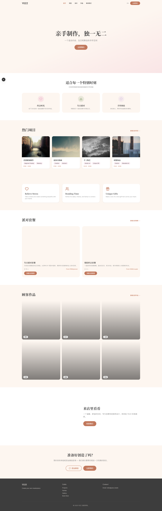
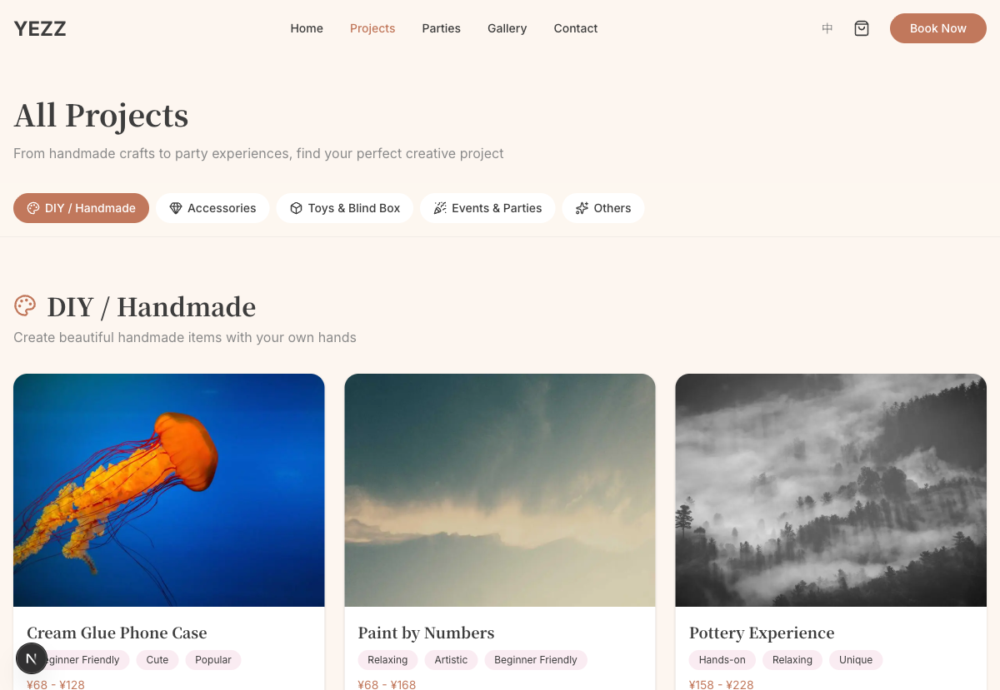
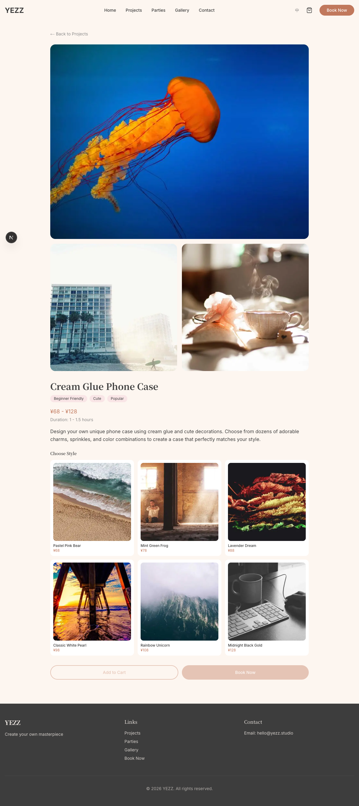

# YezYY

**A bilingual booking, commerce, and operations platform for a Melbourne DIY studio.**

[Live Website](https://yezyy.com) · [API Health](https://yezz-api.fly.dev/health)

YezYY combines a polished customer website with a practical administration system. Customers can explore projects, build a cart, request bookings, and discover studio events in English or Chinese. Staff can manage projects, categories, bookings, orders, gallery content, parties, availability, and users from a protected dashboard.



## Product Highlights

### Customer experience

- Localised English and Chinese routes with `next-intl`
- Searchable project catalogue with categories and project detail pages
- Multi-item cart and booking/order submission flows
- Party, gallery, contact, and studio information pages
- Responsive layouts, loading states, validation, and error boundaries

### Administration

- JWT-protected admin dashboard
- CRUD workflows for projects, categories, gallery items, parties, and settings
- Booking, order, time-slot, notification, and user management
- S3-compatible media uploads for local MinIO and production Cloudflare R2
- OpenAPI documentation for the REST API

## Architecture

```text
Customer / Admin Browser
          |
          v
Next.js 16 Web App (Vercel)
          |
          v
Fastify REST API (Fly.io)
      |          |          |
      v          v          v
PostgreSQL     Redis     Cloudflare R2
  (Neon)      cache       media storage
```

The monorepo keeps the public site, admin UI, API, and database package independently buildable while sharing one package manager and consistent TypeScript tooling.

## Technology

| Layer | Technologies |
| --- | --- |
| Web | Next.js 16, React 19, TypeScript, Tailwind CSS, next-intl, React Hook Form, Zod |
| API | Node.js, Fastify, JWT, Swagger/OpenAPI, multipart uploads |
| Data | PostgreSQL, Drizzle ORM, Redis |
| Testing | Vitest, Playwright, ESLint, TypeScript |
| Infrastructure | Docker Compose, Vercel, Fly.io, Neon, Cloudflare R2 |

## Engineering Decisions

- **Relational data with PostgreSQL:** bookings, orders, projects, categories, users, and availability benefit from explicit relationships and constraints.
- **Separate web and API applications:** the customer UI and admin UI share a Next.js application while business operations remain behind a versioned REST API.
- **Shared S3 interface:** local development uses MinIO and production uses Cloudflare R2 without changing the upload workflow.
- **Layered validation:** browser forms, API schemas, and database constraints each protect the system at a different boundary.
- **Production-like local setup:** Docker Compose starts the supporting services needed to exercise the full application locally.

## Repository Layout

```text
yezz/
├── apps/
│   ├── web/          # Next.js customer site and admin dashboard
│   └── api/          # Fastify REST API
├── packages/
│   └── db/           # Drizzle schema, migrations, and seed data
├── docs/             # Architecture, product, and deployment notes
├── docker-compose.yml
├── docker-compose.dev.yml
└── fly.toml
```

## Run Locally

### Prerequisites

- Node.js 22+
- pnpm 10 (`corepack enable`)
- Docker

### Setup

```bash
pnpm install
cp .env.example .env
docker compose -f docker-compose.dev.yml up -d
pnpm db:migrate
pnpm db:seed
```

Run the API and web application in separate terminals:

```bash
pnpm dev:api
pnpm dev:web
```

- Website: `http://localhost:3000`
- API: `http://localhost:4000`
- OpenAPI documentation: `http://localhost:4000/docs`
- Health check: `http://localhost:4000/health`

To start the complete Docker environment instead:

```bash
cp .env.example .env
pnpm docker:up
```

Stop it with:

```bash
pnpm docker:down
```

## Quality Checks

```bash
pnpm typecheck
pnpm test:api
pnpm test:e2e
pnpm --filter @yezz/web build
```

The test suite covers API helpers and validation as well as browser-level customer and administration flows.

## Deployment

| Component | Platform |
| --- | --- |
| Web application | Vercel |
| REST API | Fly.io |
| PostgreSQL | Neon |
| Media storage | Cloudflare R2 |

Production credentials are configured in the relevant hosting platforms and are not stored in the repository.

## More Screens




