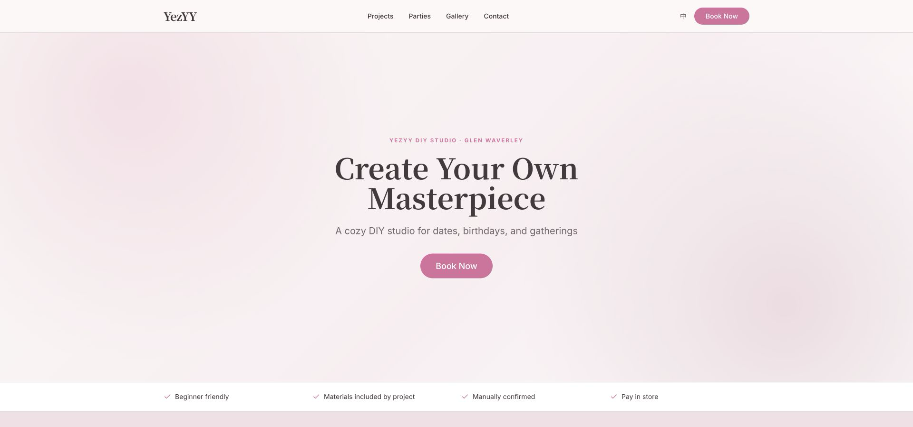

# YezYY

**A production bilingual booking and operations platform for an operating DIY studio in Glen Waverley, Melbourne.**

[Live Website](https://yezyy.com) · [API Health](https://yezz-api.fly.dev/health)



## The Product

YezYY supports the day-to-day customer and staff workflows of a physical DIY studio. The public website helps customers understand the available experiences, request an ordinary DIY session or party, and manage an existing booking in English or Chinese. A protected administration system gives staff one place to review requests, manage schedules, maintain studio content, and record operational decisions.

Bookings are manually confirmed and paid in store. Public product shopping is intentionally disabled at the current business stage so the live experience remains focused on studio visits and parties.

## Customer Booking Experience

- English and Chinese routes powered by `next-intl`
- Project discovery organised by DIY category, price, and estimated duration
- Four-step ordinary DIY request flow with project, attendance, time, and contact details
- Three-step party request flow with participant details, scheduling, DIY interests, food, and optional services
- Capacity-aware time availability with waitlist support
- Human confirmation and in-store payment communicated throughout the request journey
- Secure customer links for rescheduling and cancellation
- Responsive layouts, accessible form controls, contextual validation, and clear success states

## Staff Operations

- JWT-protected Chinese administration dashboard
- Booking review, confirmation, rejection, rescheduling, cancellation, and status history
- Schedule, closure, special-hours, and capacity management
- Catalogue, category, gallery, party, settings, and user administration
- Notification and email-delivery visibility for operational follow-up
- S3-compatible media uploads using local MinIO and production Cloudflare R2
- OpenAPI documentation for the REST API

## Business Rules in Code

- Availability is calculated in the `Australia/Melbourne` timezone.
- Requests respect the studio's opening hours, closures, special hours, lead time, capacity, duration, and party exclusivity.
- Ordinary DIY requests support one to eight participants; party requests support four to eight.
- Overlapping reservations use half-open time intervals so adjacent sessions can share a boundary safely.
- Server-side validation rechecks availability when a request is created instead of trusting browser state.
- Booking state changes, status history, and notification outbox records are committed atomically.
- Customer actions use scoped, expiring tokens rather than exposing administration credentials.

## Architecture

```text
Customer / Staff Browser
          |
          v
Next.js 16 Web App (Vercel)
          |
          v
Fastify REST API (Fly.io)
      |          |          |
      v          v          v
PostgreSQL     Redis     Cloudflare R2
  (Neon)      cache       media storage
```

The monorepo keeps the public site, administration interface, API, and database package independently buildable while sharing one package manager and consistent TypeScript tooling.

## Technology

| Layer | Technologies |
| --- | --- |
| Web | Next.js 16, React 19, TypeScript, Tailwind CSS, next-intl, React Hook Form, Zod |
| API | Node.js, Fastify, JWT, Swagger/OpenAPI, multipart uploads |
| Data | PostgreSQL, Drizzle ORM, Redis |
| Testing | Vitest, Playwright, ESLint, TypeScript |
| Infrastructure | Docker Compose, Vercel, Fly.io, Neon, Cloudflare R2 |

## Engineering Decisions

- **Relational data with PostgreSQL:** bookings, projects, schedules, users, status events, and availability benefit from explicit relationships and constraints.
- **Server-authoritative booking rules:** the browser guides the customer, while the API and database protect capacity and state transitions under concurrent requests.
- **Separate web and API applications:** customer and staff interfaces share a Next.js application while business operations remain behind a versioned REST API.
- **Transactional operational events:** booking mutations, audit history, and notification outbox entries succeed or roll back together.
- **Shared S3 interface:** local development uses MinIO and production uses Cloudflare R2 without changing the upload workflow.
- **Production-like local setup:** Docker Compose starts the supporting services needed to exercise the complete application locally.

## Repository Layout

```text
yezz/
├── apps/
│   ├── web/          # Next.js customer site and staff dashboard
│   └── api/          # Fastify REST API
├── packages/
│   └── db/           # Drizzle schema, migrations, and seed data
├── docs/             # Architecture, product, and deployment notes
├── docker-compose.yml
├── docker-compose.dev.yml
└── fly.toml
```

## Run Locally

### Prerequisites

- Node.js 22+
- pnpm 10 (`corepack enable`)
- Docker

### Setup

```bash
pnpm install
cp .env.example .env
docker compose -f docker-compose.dev.yml up -d
pnpm db:migrate
pnpm db:seed
```

Run the API and web application in separate terminals:

```bash
pnpm dev:api
pnpm dev:web
```

- Website: `http://localhost:3000`
- API: `http://localhost:4000`
- OpenAPI documentation: `http://localhost:4000/docs`
- Health check: `http://localhost:4000/health`

To start the complete Docker environment instead:

```bash
cp .env.example .env
pnpm docker:up
```

Stop it with `pnpm docker:down`.

## Quality and Release Gates

```bash
pnpm typecheck
pnpm test:api
pnpm test:e2e
pnpm --filter @yezz/web build
```

The automated suite covers customer and staff flows, API validation, database migrations, catalogue bootstrap, and booking transactions.

The booking transaction suite is a required release gate and must run against a disposable local PostgreSQL database whose name contains `test`, `local`, or `dev`:

```bash
TEST_DATABASE_URL=postgres://localhost/yezyy_test pnpm test:api:booking-db
```

This suite fails closed when the test database is missing, unavailable, equal to `DATABASE_URL`, or not clearly named as non-production. It covers reservation rollback, concurrent create and cancel idempotency, status-event and outbox atomicity, and immutable staff booking views.

The complete release gate creates an isolated loopback-only PostgreSQL environment, applies current migrations, runs the database-backed booking and bootstrap suites, and removes its containers and volumes when finished:

```bash
pnpm verify:release
```

## Deployment

| Component | Platform |
| --- | --- |
| Web application | Vercel |
| REST API | Fly.io |
| PostgreSQL | Neon |
| Media storage | Cloudflare R2 |

Production credentials are configured in the relevant hosting platforms and are not stored in this repository.
